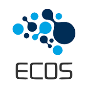
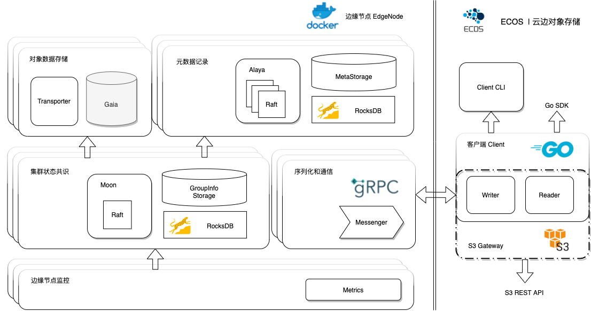
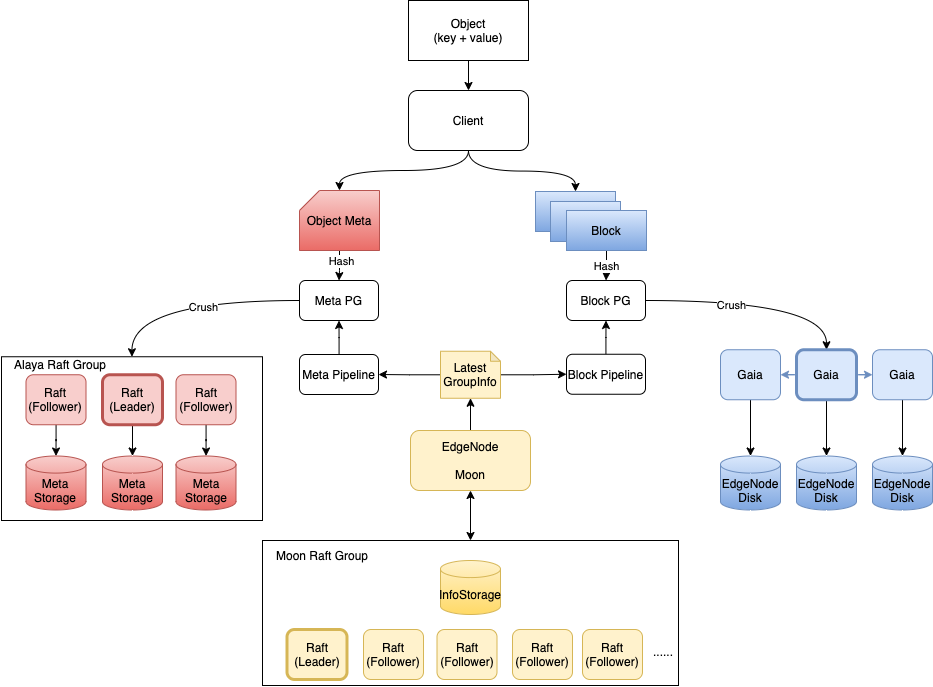

ECOS
=========

An edge-cloud collaborative object storage

云边协同的分布式对象存储

---

ECOS 具有以下特点：
- 无中心元数据服务器，使用 CRUSH 算法计算寻址
- 多副本读写策略
- 针对边缘环境进行优化，适应于集群扩容频繁的场景，降低新节点上线后的迁移开销
- 对象元数据和对象数据分离，使用 RocksDB 管理对象元数据
- 分片和自动去重机制
- 使用 Raft 维护集群状态信息和对象元数据一致性
- 无需迁移的写入平衡策略*
- 云边协同：热点数据识别，云端数据冷备，边缘智能副本数*
- AWS S3 REST 接口适配*

## 架构

## 客户端写流程

## MileStone

### v0.0

- [x] 元数据同步模块
- [x] 对象数据三节点同步
- [x] 边缘节点自组织
- [x] 客户端对象分块，putBlock
- [x] 客户端写对象元数据

### v0.1

- [x] 集群信息同步给客户端
- [x] EdgeNode 初始化 Alaya & Gaia
- [x] Alaya Raft Leader 转移给默认首节点
- [x] 完整的对象上传流程

### v0.2

- [x] 对象下载 rpc 定义
- [x] Object 元数据持久化
- [x] 完整的对象下载流程

### v0.3

- [x] 多用户，多 bucket 支持
- [x] 节点临时掉线异常处理
- [x] 节点重启后重新加入集群

### v0.4

- [x] 边缘节点扩缩容

### v1.x

- [x] S3 网关适配
- [ ] 用户指定的云边协同

### v2.x

- [ ] 自动的云边协同
- [x] Crush 算法优化

### v3.x

- [ ] 用户身份鉴权
- [ ] 边缘节点鉴权